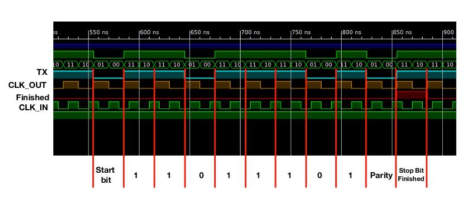

### Custom UART module

This repository contains a raw UART module implemented in Verilog. 

## 1. Interface 
It provides the following input and output connections: 

| Signal       | Description                                                       |
|--------------|-------------------------------------------------------------------|
| clk          | Input clock must match the parameter Base Frequency               |
| start_signal | Must be set to HIGH until the active signal changes to HIGH.      |
| value        | 8 Bit input value to write.                                       |
| UartRx       | Input rx signal reading data from the UART bus.                   |
| UartRx       | Output tx signal to send data on a UART but                       |
| active       | HIGH indicates that the module is currently processing.           |
| ready        | Indicating for one clock cycle that the current task was executed |

## 2. Custom parameters

| Parameter     | Description                                                       |
|---------------|-------------------------------------------------------------------|
| Base Frequeny | Input frequency in Hz.                                            |
| Baudrate      | Number of chars per time unit. Possible deviations occur when the base frequency is not devidable by the base frequency!      |
| Data Length   | Currently only 8 bit supported.
| Parity        | Supported 0: None, 1: Even, 2: Oddd                   |
| Stopbits      | 1 or 2 stopbits are supported                       |

## 3. Block design

The module can be added to the block diagram, by adding the **ip** folder to the IP-catalog as repository.

## 3. Simulation

The module was tested and verified by a test bench.

This figure shows a simulation of the verilog module sending 11011101 (187) with parity even and one stop bit.

## 4. Tested devices

 It was developed and tested on a Digilent Atlys board using a Xilinx Spartan-6 FPGA as well as a PYNQ Z2.
